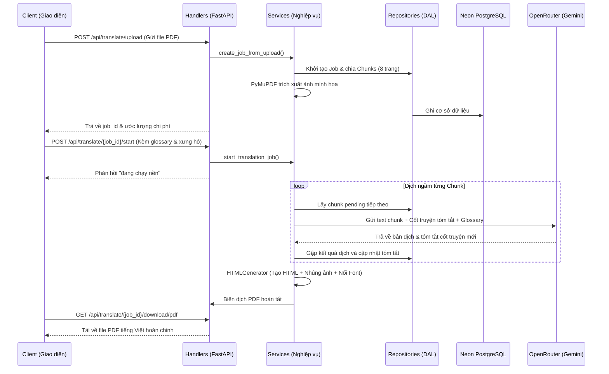

# 📚 NovelTrans AI: English-to-Vietnamese PDF Novel Translator Backend

<div align="center">

[](https://www.python.org/)
[](https://fastapi.tiangolo.com/)
[](https://neon.tech/)
[](https://openrouter.ai/)
[](LICENSE)

**Hệ thống Backend dịch thuật tiểu thuyết văn học định dạng PDF chất lượng cao, tích hợp bảo toàn hình ảnh minh họa và tạo sách PDF A5 chuyên nghiệp.**

[Tính Năng Nổi Bật](#-tính-năng-nổi-bật) • [Kiến Trúc Phân Lớp](#-kiến-trúc-phân-lớp) • [Hướng Dẫn Cài Đặt](#-hướng-dẫn-cài-đặt) • [Tài Liệu API](#-tài-liệu-api) • [Giấy Phép](#-giấy-phép)

</div>

---

## 🌟 Tính Năng Nổi Bật

*   **📖 Dịch văn học ngữ cảnh cuộn chiếu (Rolling Context)**: Duy trì một chuỗi tóm tắt cốt truyện liên tục qua từng phân đoạn (Chunk 8 trang) để đảm bảo tính nhất quán của cốt truyện và ngăn ngừa hiện tượng trôi lệch đại từ nhân xưng ở các chương sau.
*   **🎭 Quản lý danh xưng & thuật ngữ (Glossary)**: Tự động quét đề xuất nhân vật chính trong 10 trang đầu. Hỗ trợ tùy chỉnh đại từ nhân xưng ("hắn", "nàng", "chàng", "gã", "y") cho từng nhân vật theo ý muốn.
*   **🖼️ Bảo toàn hình ảnh minh họa tự động**: Tự động trích xuất các tệp ảnh minh họa từ PDF gốc bằng PyMuPDF và tái định vị nhúng vào đúng trang tương ứng trên bản dịch PDF.
*   **🎨 Định dạng sách A5 Literary**: Biên dịch PDF tự động sử dụng `xhtml2pdf` kết hợp phông chữ Lora Google Fonts mang đậm phong cách văn học cổ điển, căn lề justify chuẩn mực.
*   **⚙️ Bản vá khóa file tạm Windows**: Tích hợp Monkey-Patch xử lý triệt để lỗi xung đột file tạm `TTFError: Can't open file` trên hệ điều hành Windows.
*   **🛡️ Ép buộc dùng BYOK (Bảo vệ credit OpenRouter)**: Thiết lập cấu hình `allow_fallbacks=False` mặc định giúp khóa cứng kết nối, không cho tự động chuyển sang luồng trả phí OpenRouter khi key cá nhân bị rate-limit.
*   **🔄 Tự khôi phục & Tiếp tục dịch (Resume/Self-healing)**: Cho phép dừng tiến trình và tiếp tục dịch cuốn chiếu page-by-page. Hỗ trợ API `/reset` để dịch lại một vài phân đoạn trang mong muốn sau khi sửa đổi glossary.

---

## 🏗️ Kiến Trúc Phân Lớp (DDD-Lite)

Dự án được cấu trúc theo mô hình layered architecture tách biệt rõ ràng trách nhiệm để dễ bảo trì, mở rộng:

```
app/
├── handlers/         # Lớp Giao Tiếp (HTTP Endpoints / FastAPI Routers)
├── services/         # Lớp Nghiệp Vụ (Business Logic: dịch thuật, tạo PDF, quét glossary)
├── repositories/     # Lớp Truy Xuất Dữ Liệu (SQLAlchemy Queries)
└── models & schemas/ # Lớp Thực Thể (DB Models & Pydantic DTOs)
```

### Sơ đồ luồng hoạt động chính:



---

## 🚀 Hướng Dẫn Cài Đặt

### 1. Yêu cầu hệ thống
*   Python 3.9 trở lên
*   Cơ sở dữ liệu PostgreSQL (Khuyên dùng Neon Tech) hoặc SQLite cục bộ

### 2. Cài đặt các gói phụ thuộc
Tải mã nguồn và cài đặt thư viện:
```bash
git clone https://github.com/your-username/pdf-novel-translator.git
cd pdf-novel-translator
python -m venv venv
# Windows:
.\venv\Scripts\activate
# macOS/Linux:
source venv/bin/activate

pip install -r requirements.txt
```

### 3. Cấu hình môi trường
Sao chép file `.env.example` thành `.env` và cấu hình các khóa bảo mật của bạn:
```bash
cp .env.example .env
```
Mở `.env` bằng trình chỉnh sửa và cập nhật:
*   `OPENROUTER_API_KEY`: API Key OpenRouter của bạn.
*   `DATABASE_URL`: Đường dẫn kết nối database Neon PostgreSQL (hoặc giữ mặc định SQLite cục bộ).
*   `OPENROUTER_ALLOW_FALLBACKS`: Đặt thành `False` để ép buộc sử dụng BYOK.

### 4. Khởi chạy Server
```bash
python main.py
```
Sau khi chạy, truy cập đường dẫn sau trên trình duyệt để sử dụng Swagger UI tương tác:
👉 **[http://127.0.0.1:8000/docs](http://127.0.0.1:8000/docs)**

---

## 📝 Tài Liệu API

### API Quản lý dịch thuật (`/api/translate`)

| Method | Endpoint | Tham số đầu vào | Mô tả |
| :--- | :--- | :--- | :--- |
| `POST` | `/upload` | File PDF | Tải lên sách tiếng Anh, chia chunks & trích xuất ảnh |
| `POST` | `/{job_id}/start` | `JobSettingsUpdate` | Thiết lập cách xưng hô, glossary và kích hoạt luồng dịch ngầm |
| `POST` | `/{job_id}/pause` | - | Tạm dừng tiến trình dịch thuật |
| `POST` | `/{job_id}/reset` | `start_page`, `end_page` (tùy chọn) | Đưa phân đoạn (hoặc cả cuốn) về `pending` để dịch lại |
| `GET` | `/{job_id}` | - | Lấy tiến độ phần trăm (%) và trạng thái hiện tại |
| `GET` | `/{job_id}/download/pdf` | `force=true` (tùy chọn) | Tải bản dịch PDF (tự tạo lại nếu file lỗi hoặc dùng cờ `force`) |
| `GET` | `/{job_id}/download/html` | - | Tải bản HTML dự phòng để in thủ công |

### API Đề xuất bảng từ vựng (`/api/jobs`)

| Method | Endpoint | Tham số | Mô tả |
| :--- | :--- | :--- | :--- |
| `POST` | `/{job_id}/glossary/scan` | - | AI quét 10 trang đầu tự động gợi ý nhân vật & xưng hô |
| `GET` | `/{job_id}/glossary` | - | Lấy danh sách glossary hiện hữu |
| `POST` | `/{job_id}/glossary` | `List[GlossaryItem]` | Cập nhật/Ghi đè bảng glossary tùy chỉnh |

---

## 🛠️ Hướng Dẫn Khắc Phục Lỗi (Troubleshooting)

### 1. Sách bị lỗi ô vuông đen `[]`
*   **Nguyên nhân**: Thiếu bộ font Lora cục bộ hoặc `xhtml2pdf` không đọc được font do lỗi phân giải đường dẫn tương đối.
*   **Cách xử lý**: Đảm bảo máy chủ có kết nối Internet để tải tự động font Lora vào `app/resources/fonts/` trong lần đầu chạy, hoặc hệ thống sẽ tự động fallback sang `Times New Roman` hệ thống. Gọi download với `?force=true` để bắt buộc build lại.

### 2. Có các chữ `--- TRANG X ---` bị in đè lên nội dung
*   **Nguyên nhân**: AI tự động dịch nhãn trang sang tiếng Việt nên bộ tách trang cũ bỏ sót.
*   **Cách xử lý**: Bản cập nhật hiện tại đã mở rộng Regex bắt toàn bộ các cụm `(?i)-+\s*(?:page|trang)\s*\d+\s*-+` và ẩn chúng hoàn toàn. Chỉ cần thực hiện gọi `/reset` phân đoạn bị dính chữ rồi start dịch lại hoặc gọi biên dịch cưỡng bức `force=true` để tạo lại tệp.

---

## 📄 Giấy Phép (License)

Dự án được phân phối dưới giấy phép MIT License. Xem chi tiết tại tệp `LICENSE` (nếu có).

---
